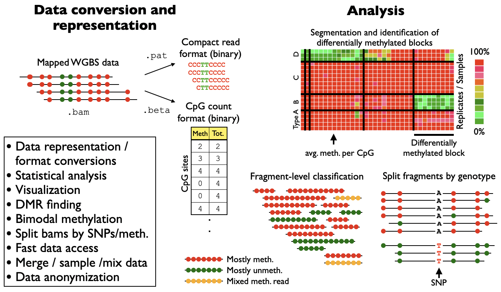
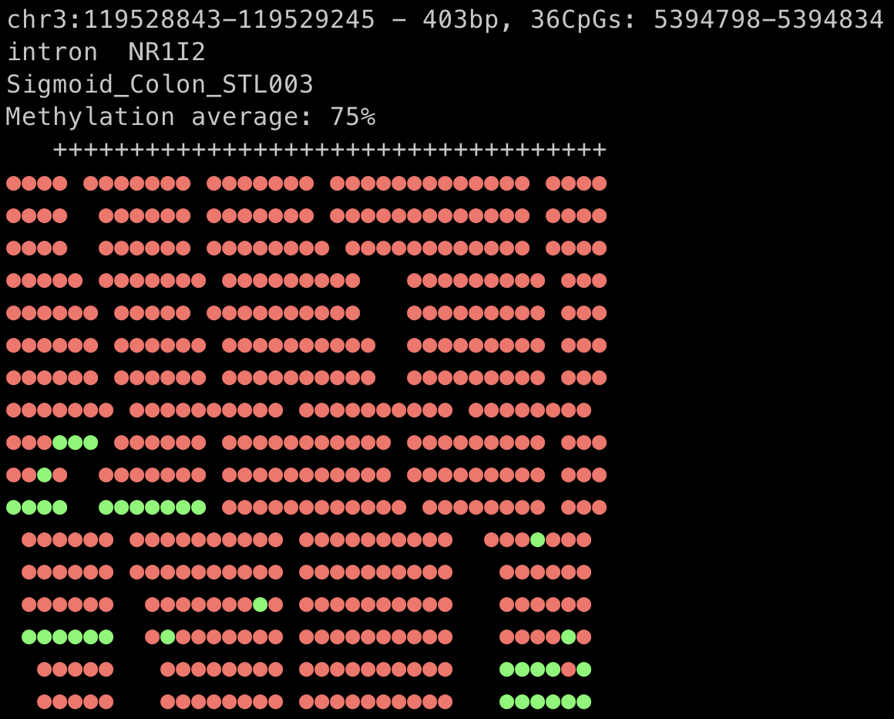

# wgbstools - suite for DNA methylation sequencing data conversion, visualization, and analysis
wgbstools is an extensive computational suite tailored for bisulfite sequencing data. 
It allows fast access and ultra-compact representation of high-throughput data,
as well as machine learning and statistical analysis, and informative visualizations, 
from fragment-level to locus-specific representations.

It converts data from standard formats (e.g., bam, bed) into tailored compact yet useful and intuitive formats ([pat](docs/pat_format.md), [beta](docs/beta_format.md)).
These can be visualized in terminal, or analyzed in different ways - subsample, merge, slice, mix, segment and more.



## Quick start
### Installation

```bash
# Clone
git clone https://github.com/nloyfer/wgbs_tools.git
cd wgbs_tools

# compile
python setup.py
```

### Genome configuration
Reference genome/s must be configured. Make sure you have a reference genome FASTA (e.g `hg19.fa`).
The FASTA must not be compressed (gzipped).
For exapmle, download the hg19 genome from the UCSC genome browser:
```bash
# download a genome FASTA, if you don't have one
curl https://hgdownload.soe.ucsc.edu/goldenPath/hg19/bigZips/hg19.fa.gz -o hg19.fa.gz
gunzip hg19.fa.gz

# Setup reference genome GENOME_NAME (e.g hg19).
wgbstools init_genome /path/to/genome.fa GENOME_NAME
# E.g, wgbstools init_genome ./hg19.fa.gz hg19
```
#### Dependencies
- python 3+
- samtools
#### Dependencies for some features:
- bedtools


### Usage examples
Now you can generate `pat.gz` and `beta` files out of `bam` files:
```bash
wgbstools bam2pat Sigmoid_Colon_STL003.bam
# output:
# Sigmoid_Colon_STL003.pat.gz
# Sigmoid_Colon_STL003.beta
```

Once you have `pat` and `beta` files, you can use wgbstools to visualize them. For example:

```bash
wgbstools vis Sigmoid_Colon_STL003.pat.gz -r chr3:119528843-119529245
```


```bash
wgbstools vis *.beta -r chr3:119528843-119529245
```

