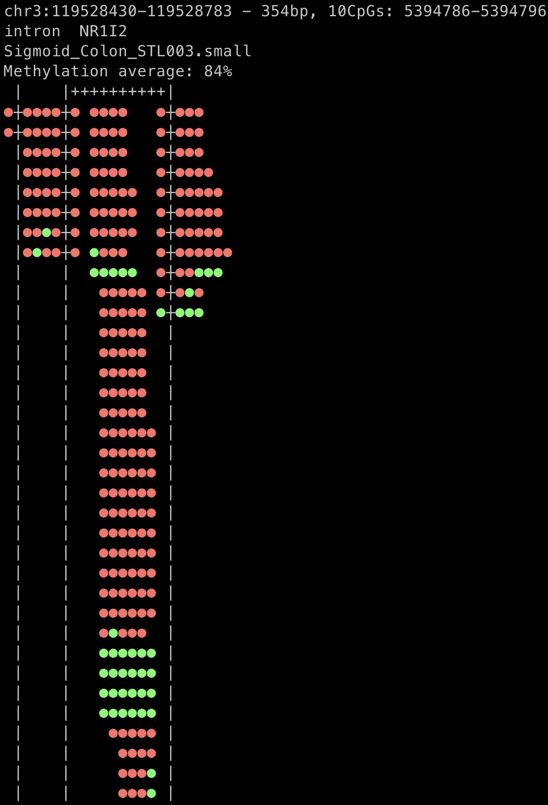

# wgbstools tutorial
## Installation and configuration
First install `wgbstools` and configure the `hg19` genome
```bash
git clone https://github.com/nloyfer/wgbs_tools.git
cd wgbs_tools
python setup.py
wgbstools init_genome hg19
```

It is recommended to add wgbstools to your $PATH, E.g,
```bash
export PATH=${PATH}:$PWD
```

## All set. Let's begin
### Data and region
For this short tutorial, we will use the following publicly available samples from the [Roadmap Epigenomic Project](https://www.nature.com/articles/nature14248). The fastq files were downloaded from [GEO](https://www.ncbi.nlm.nih.gov//geo/query/acc.cgi?acc=GSE16256), mapped to hg19 using [bwa-meth](https://github.com/brentp/bwa-meth), and finally sliced to to the region `chr3:119,527,929-119,531,943`

| SRX  | Tissue  |  Donor |
|---|---|---|
| [SRX175350](https://www.ncbi.nlm.nih.gov/sra?term=SRX175350) |  Lung cells          | STL002
| [SRX388743](https://www.ncbi.nlm.nih.gov/sra?term=SRX388743) |  Pancreas cells      | STL002
| [SRX190161](https://www.ncbi.nlm.nih.gov/sra?term=SRX190161) |  Sigmoid colon cells | STL003

```bash
$ cd tutorial
$ ls -1 bams/*bam
Lung_STL002.small.bam
Pancreas_STL002.small.bam
Sigmoid_Colon_STL003.small.bam
```

To keep things compact, we consider a small region of ~4Kb, covering 100 CpG sites.
`convert` command translates genomic loci to CpG-index range and vice verca. It also prints genomic annotations, when available (currently only hg19).
```bash
$ region=chr3:119527929-119531943
$ wgbstools convert -r $region
chr3:119527929-119531943 - 4,015bp, 100CpGs: 5394767-5394867
intron  NR1I2
exon    NR1I2
intron  NR1I2
exon    NR1I2
```

### Generate pat & beta files
To generate [`pat`](docs/pat_format.md) and [`beta`](docs/beta_format.md)) files for each of the samples, we use the `bam2pat` command.
```bash
$ wgbstools bam2pat bams/*.bam -r $region
[wt bam2pat] bam: bams/Lung_STL002.small.bam
[ patter ] [ chr3 ] finished 2,793 lines. 1,813 good, 980 empty, 0 invalid. (success 100%)
[wt bam2pat] bgzipping and indexing:
[wt bam2pat] generated ./Lung_STL002.small.pat.gz
[wt bam2pat] generated ./Lung_STL002.small.beta
[wt bam2pat] bam: bams/Pancreas_STL002.small.bam
[ patter ] [ chr3 ] finished 814 lines. 516 good, 298 empty, 0 invalid. (success 100%)
[wt bam2pat] bgzipping and indexing:
[wt bam2pat] generated ./Pancreas_STL002.small.pat.gz
[wt bam2pat] generated ./Pancreas_STL002.small.beta
[wt bam2pat] bam: bams/Sigmoid_Colon_STL003.small.bam
[ patter ] [ chr3 ] finished 2,986 lines. 1,989 good, 997 empty, 0 invalid. (success 100%)
[wt bam2pat] bgzipping and indexing:
[wt bam2pat] generated ./Sigmoid_Colon_STL003.small.pat.gz
[wt bam2pat] generated ./Sigmoid_Colon_STL003.small.beta

$ ls -1 *pat* *beta
Lung_STL002.small.beta
Lung_STL002.small.pat.gz
Lung_STL002.small.pat.gz.csi
Pancreas_STL002.small.beta
Pancreas_STL002.small.pat.gz
Pancreas_STL002.small.pat.gz.csi
Sigmoid_Colon_STL003.small.beta
Sigmoid_Colon_STL003.small.pat.gz
Sigmoid_Colon_STL003.small.pat.gz.csi
```

### Segmentation 
Segment the region into homogenously methylated blocks
```bash
$ wgbstools segment --betas *beta --min_cpg 3 --max_bp 2000 -r $region -o blocks.small.bed
[wt segment] found 9 blocks
             (dropped 8 short blocks)
$ cat blocks.small.bed
chr3    119527929       119528187       5394767 5394772
chr3    119528217       119528243       5394774 5394777
chr3    119528246       119528309       5394777 5394781
chr3    119528384       119528418       5394782 5394786
chr3    119528430       119528783       5394786 5394796
chr3    119528806       119529245       5394796 5394834
chr3    119529584       119530116       5394837 5394844
chr3    119530396       119530598       5394846 5394856
chr3    119531385       119531943       5394858 5394867
```
The output bed file has 5 columns: chr, start, end, startCpG, endCpG (non inclusive). For example, the first block is chr3:119,527,929-119,528,187, 258bp, 5 CpG sites.
The segmentation algorithm finds a partition of the genome that optimizes some homogeneity score, i.e, the CpG sites in each block tend to have a similar methylation status. Many of the blocks are typically singletons (covering a single CpG site), but they are dropped when the `--min_cpg MIN_CPG` flag is specified.
In this example, the `segment` command segmented the region chr3:119,527,929-119,531,943 to 17 blocks, 9 of them cover at least 3 CpG sites.

#### Index bed
Optional: bgzip and index the output blocks, make it easier to access.
`index` command wraps bgzip and tabix. It compresses a bed (or pat) file and generates corresponding index file. This step is necessary if you wish to visualize these blocks later using `vis` command.
```bash
$ wgbstools index blocks.small.bed
$ ls -1 blocks.small.*
blocks.small.bed.gz
blocks.small.bed.gz.tbi
```

### collapse beta files to blocks
Collapse the beta files to the blocks we just found:

```zsh
$ wgbstools beta_to_table blocks.small.bed.gz --betas *beta | column -t
chr   start      end        startCpG  endCpG   Lung_STL002.small  Pancreas_STL002.small  Sigmoid_Colon_STL003.small
chr3  119527929  119528187  5394767   5394772  0.87               0.92                   0.96
chr3  119528217  119528243  5394774   5394777  0.74               1.00                   0.92
chr3  119528246  119528309  5394777   5394781  0.43               0.73                   0.80
chr3  119528384  119528418  5394782   5394786  0.21               0.45                   0.92
chr3  119528430  119528783  5394786   5394796  0.08               0.28                   0.76
chr3  119528806  119529245  5394796   5394834  0.00               0.00                   0.76
chr3  119529584  119530116  5394837   5394844  0.96               0.97                   0.96
chr3  119530396  119530598  5394846   5394856  0.94               0.91                   0.95
chr3  119531385  119531943  5394858   5394867  0.87               0.87                   0.96
```

### Visualizations
try different forms of visualizations

```bash
$ wgbstools vis -r chr3:119527929-119531943 -b blocks.small.bed.gz *beta
```
<!---->


```bash
$ wgbstools vis -r chr3:119527929-119531943 -b blocks.small.bed.gz *beta --heatmap
```
<!---->


```bash
$ wgbstools vis -r chr3:119528585-119528783 -b blocks.small.bed.gz Sigmoid_Colon_STL003.small.pat.gz --min_len 4
```
<!---->


### DMRs
We can use the `wgbstools find_markers` command to find DMRs for two or more groups of samples.
This command takes as input:
- beta files: a set of beta files to find the DMR for.
- group file: a `csv` table\ text file defining which beta files are case and which are control, or other groups.
- blocks file: a `bed` file with 2 extra columns for CpG indexes. Could be the output of the `wgbstools segment` command, or any custom bed file once you added the [startCpG, endCpG] columns with `wgbstools convert -L BED_FILE`.

For each group defined in the `group_file`, `find_markers` will find all regions/ blocks within the supplied blocks file that differentiate between the samples within this group when compared to samples from all other groups.
Other than these required arguments, there are plenty of configuration arguments. See `find_markers --help` for more information.

We use the following group file:
```bash
$ cat groups.csv
name,group
Lung_STL002.small,background
Pancreas_STL002.small,background
Sigmoid_Colon_STL003.small,colon
```
And find DMRs for the colon sample as follows:
```bash
$ wgbstools find_markers --blocks_path blocks.small.bed.gz --groups_file groups.csv --targets colon --betas *beta --min_cpg 4
dumped parameter file to ./params.txt
colon
Number of markers found: 4
dumping to ./Markers.colon.bed
```

